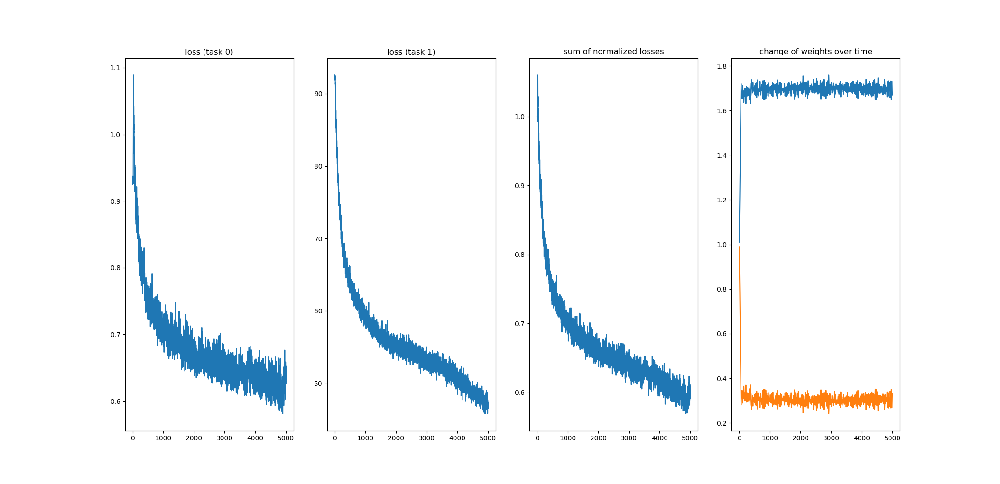

# chainer-grad-norm

Chainer implementation of the [GradNorm](https://arxiv.org/pdf/1711.02257.pdf).
GradNorm addresses the problem of balancing multiple losses for multi-task learning by learning adjustable weight coefficents.
This implementation includes the "Toy Example" presented in section 4 of the paper.

Citation:

```
@inproceedings{Chen:2018,
  author={Zhao Chen, Vijay Badrinarayanan, Chen-Yu Lee and Andrew Rabinovich},
  title={GradNorm: Gradient Normalization for Adaptive Loss Balancing in Deep Multitask Networks},
  booktitle={ICML},
  year={2018}
}
```

## Usage

```bash
$ python train.py [--gpu <gpu>] [--mode grad_norm|equal_weight] [--n-iter <n-iter>]
```

## Results

|  | Mean of loss ratio |
|:-:|:-:|
| Equal Weight | 61.84% |
| GradNorm | 58.44% |

##### Trained with fixed weight

##### Trained with GradNorm


## Relation to the implementation of the paper
The following details are missing:
1. The choice of optimizer and its hyperparameters
2. Batchsize
3. The distribution of input vectors.

Although the paper uses `sigma=[1,100]` (Figure2 top), I used `sigma=[1, 10]` instead because training did not progress as expected.
