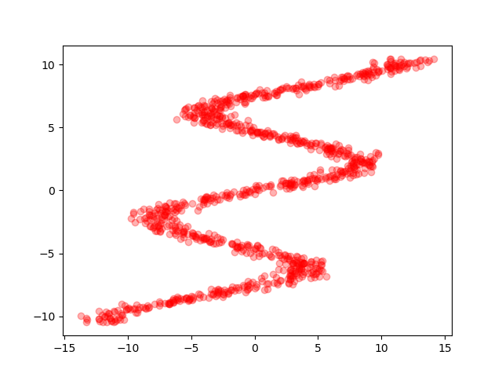
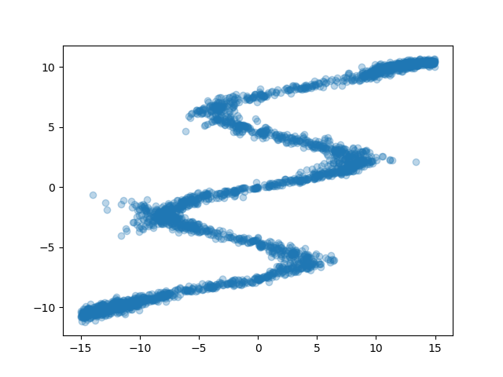
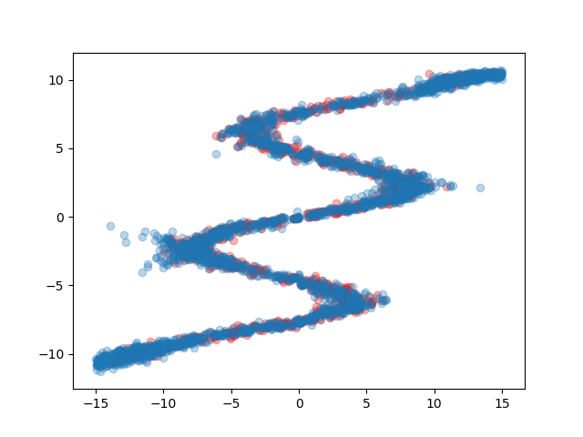
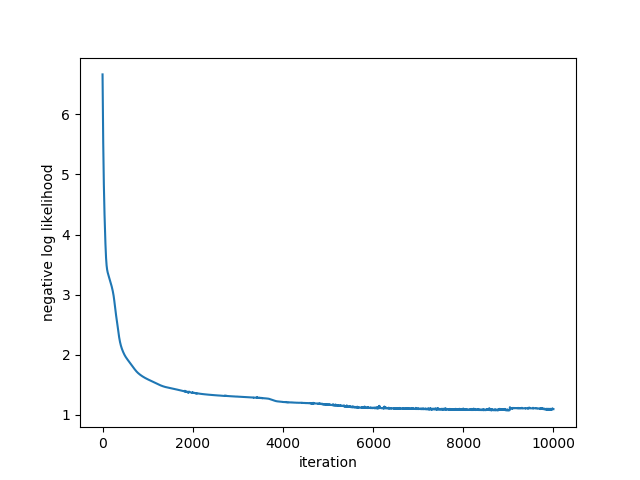

# Mixture Density Networks with Chainer

This is an example code of Mixture Density Networks implemented with Chainer.
All the parameters, the network design, and how to prepare synthetic data are the same as this article: [Mixture Density Networks with TensorFlow](http://blog.otoro.net/2015/11/24/mixture-density-networks-with-tensorflow/).

This repository is intended to be a draft for a repository in [chainer/models](https://github.com/chainer/models) which is to collect self-contained Chainer examples.

## Requirements

- [Chainer](https://chainer.org) v4.1.0
- [NumPy](http://www.numpy.org/) v1.14.0
- [Matplotlib](https://matplotlib.org/) v2.1.2

## Train

```
python train.py
```

## Results

### Target data:



### Generated data from the trained MDN:



### Generated data over the target data:



### Loss curve


