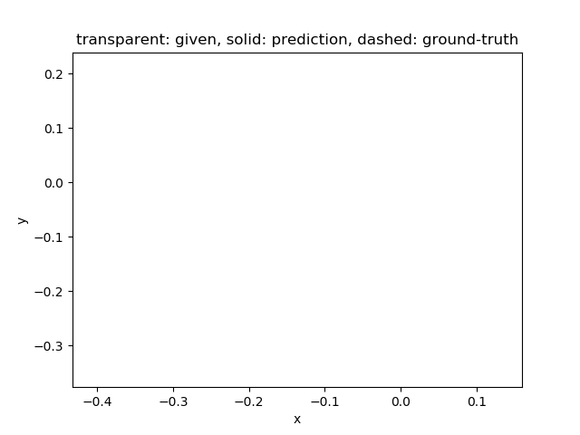

# Neural Relational Inference (NRI)

**Graph Neural Network for interacting systems**



Given a time series data of nodes, the NRI model predicts the future node states and underlying relashionship between the nodes as edges.

This is a reproduction work of the neural relational inference (NRI) in Chainer. The original implementation by the authors is found here: [ethanfetaya/NRI](https://github.com/ethanfetaya/NRI).

Please refer for details to the paper:<br />
**Neural relational inference for interacting systems.**<br />
Thomas Kipf*, Ethan Fetaya*, Kuan-Chieh Wang, Max Welling, Richard Zemel.<br />
https://arxiv.org/abs/1802.04687 (*: equal contribution)<br />

## Dataset

### Particle Physics Simulation Dataset

```bash
cd data
python generate_dataset.py
```

## Training

### Particle Physics Simulation Dataset

```bash
python train.py --gpu 0
```

## Visualize results

```bash
python utils/visualize_results.py \
--args-file results/2019-01-22_10-20-25_0/args.json \
--encoder-snapshot results/2019-01-22_10-20-25_0/encoder_epoch-500.npz \
--decoder-snapshot results/2019-01-22_10-20-25_0/decoder_epoch-500.npz \
--gpu 0
```

## Quantitative evaluation

### Accuracy (in %) of unsupervised interaction recovery

Model                 | Springs - 5 nodes (test) |
:---------------------|:-------------------------|
This implementation   | 99.8                     |
Original (from paper) | 99.9                     |

### Mean squared error (MSE) in predicting future states for simulations with 5 nodes

Model                 | Springs - 5 nodes (test) |
:---------------------|:-------------------------|
This implementation   | 3.75e-05                 |
Original (from paper) | 3.12e-8                  |