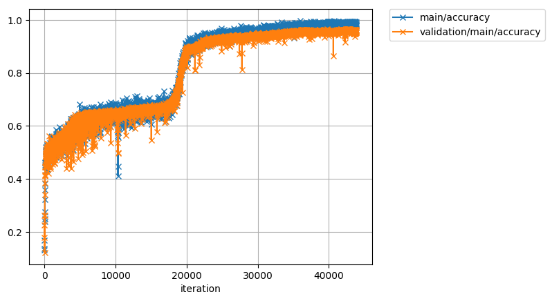
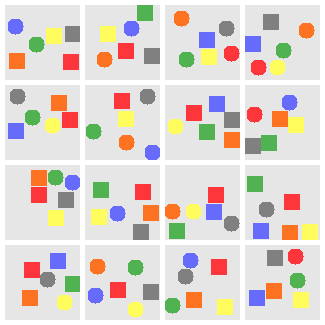

# Relation Networks

A Chainer implementation of the *Relation Networks* in [A simple neural network module
for relational reasoning](https://arxiv.org/abs/1706.01427) from DeepMind using the Sort-of-CLEVR dataset.

## Results

The model achieves 0.962 accuracy on the validation set. It is likely to improve if trained for longer.
The accuracy is averaged over both the relational and non-relational questions.
Each iteration consisted of a mini-batch of 64 image-question pairs from randomly selected images.



## Dataset

This implementation reproduces the results with the Sort-of-CLEVR dataset, described in the original paper. Some example questions and images are shown below.

### Sort-of-CLEVR



#### Relational questions

- What is the shape of the object that is closes to the gray object?
- What is the shape of the object that is furthest from the red object?
- How many objects have the shape of the orange object?


#### Non-relational questions

- Is the orange object on the left or right of the image?
- Is the blue object on the top or bottom of the image?
- What is the shape of the green object?

#### Answers

- Shape, e.g. circle or rectangle.
- Color, e.g. blue or red.
- Count, e.g. 1, 4 or 6.
- Direction, e.g. left or bottom.

The following command will generate random Sort-of-CLEVR data, i.e. random images with random questions paired with answers/target labels.
The number of relational and non-relational questions per image can be specified, as well as the image sizes and output file path but questions will remain identical to ones described in the papers.
Answers are word tokens from a vocabulary of `[left, right, top, bottom, circle, rectangle, red, green, blue, yellow, orange, gray, 1, 2, 3, 4, 5, 6]`.

```bash
python generate_sort_of_clevr.py \
    --n-images 10000 \
    --n-relational-per-image 10 \
    --n-non-relational-per-image 10 \
    --height 75 \
    --width  75 \
    --out sort_of_clevr.pkl
```

By default, 6 colors and 2 shapes; circle and rectangle are provided. It is easily extended to to additional colors, and thereby increased to more objects per image, and shapes, by directly modifying the scripts involved. You can also create [your own shapes](datasets/sort_of_clevr/shape.py), if you want, and then import then in `generate.py`.
If additional colors or shapes are generated that are not included by default, the vocabulary is updated to take those into account.

The output is a pickled Python `dict` of `numpy.ndarray`s and can be used for any similar task.

```python
import pickle

with open('sort_of_clevr.pkl', 'rb')  as f:
    data = pickle.load(f)

images = data['imgs']  # (n_images, 3, height, width)
questions = data['questions']  # (n_images, n_relational_per_image + n_non_relational_per_image, question_length)
answers = data['answers']  # (n_images, n_relational_per_image + n_non_relational_per_image)
```

## Train

To reproduce the above results, first generate the dataset as described above and run the following command. If no GPU is available in your environment, set the last argument to a negative value such as `--gpu -1`.

```bash
python train.py \
    --sort-of-clevr-path sort_of_clevr.pkl \
    --max-epochs 20 \
    --out result \
    --snapshot-iter 10000 \
    --gpu 0

```

## Test

To test a snapshot of trained model and output a prediction in a readable representation, run the following command. You need to again provide the path to the dataset as well as an index to an image for which a prediction will be computed. This image will be saved in the file path specified by `--out` and the question, prediction and the correct answer will be printed to stdout.

```bash
python demo.py \
    --sort-of-clevr-path sort_of_clevr.pkl \
    --sort-of-clevr-index 1 \
    --out result/demo.png \
    --snapshot result/snapshot_10000 \
    --gpu 0

```
