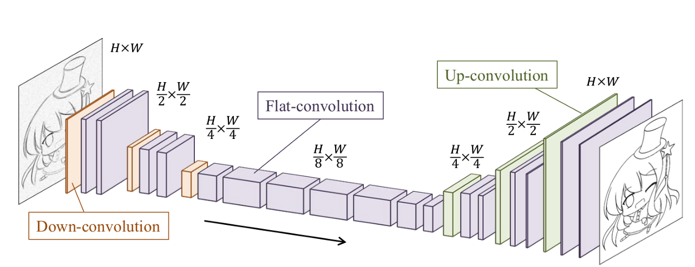
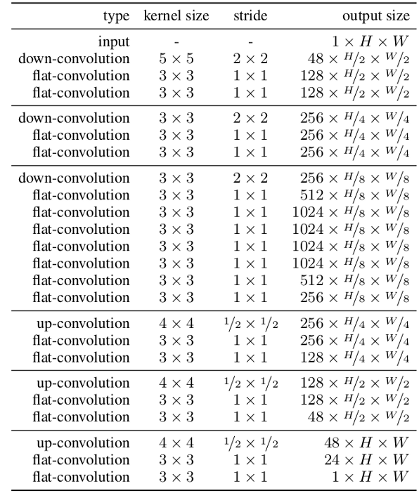
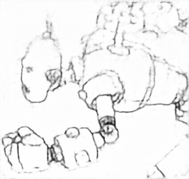
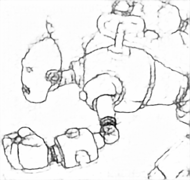
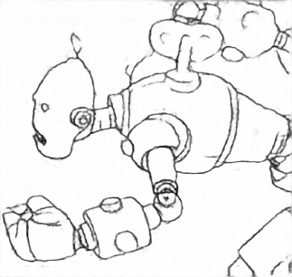
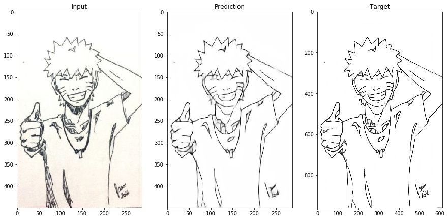
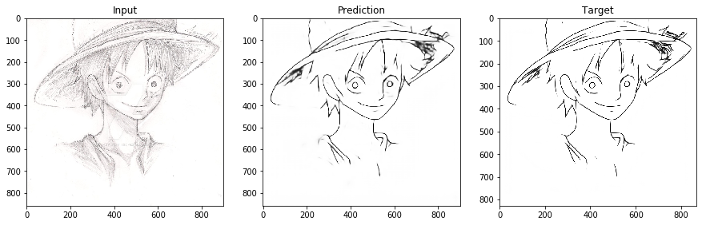
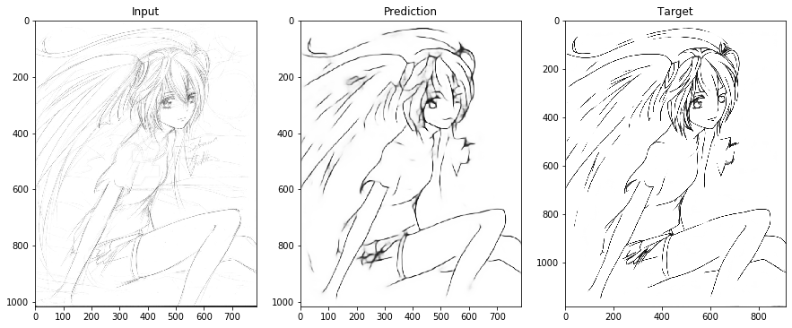
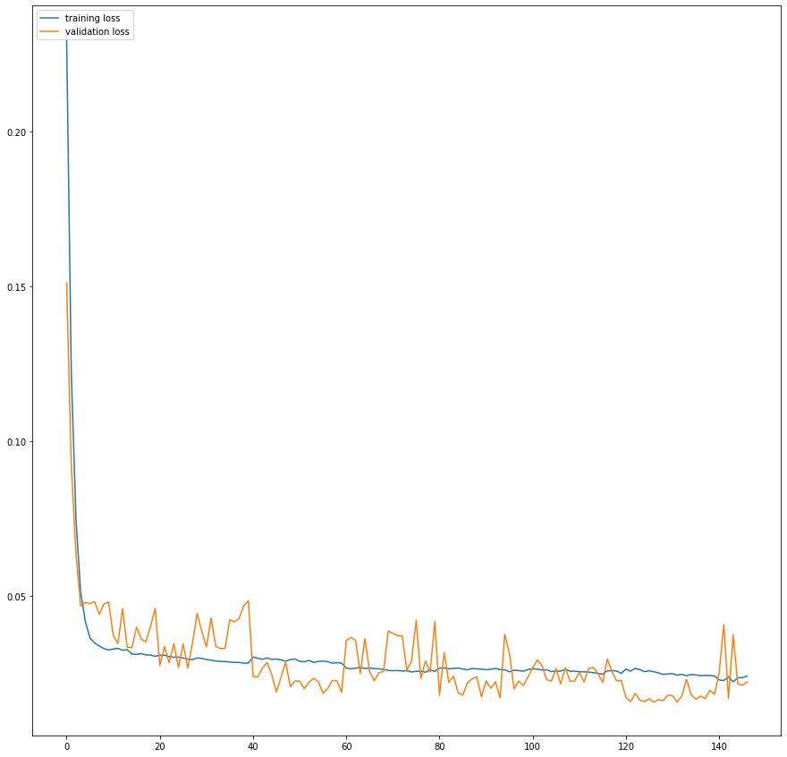

# Rough Sketch Simplification using FCNN in PyTorch

This repository contains code of the paper [Learning to Simplify: Fully Convolutional Networks for Rough Sketch Cleanup](http://www.f.waseda.jp/hfs/SimoSerraSIGGRAPH2016.pdf) which is tested and trained on custom datasets. It is based on Chainer.

## Overview

The paper presents novel technique to simplify sketch drawings based on learning a series of convolution operators. Image of any dimension can be fed into the network, and it outputs the image of same dimension as the input image.



The architecture consists of encoder and a decoder, the first part acts as an encoder and spatially compresses the image, the second part, processes and extracts the essential lines from the image, and the third and last part acts as a decoder which converts the small more simple representation to an grayscale image of the same resolution as the input. This is all done using convolutions.
The down- and up-convolution architecture may seem similar to a simple filter banks. However, it is important to realize that the number of channels is much larger where resolution is lower, e.g., 1024 where the size is 1/8. This ensures that information that leads to clean lines is carried through the low-resolution part; the network is trained to choose which information to carry by the encoder- decoder architecture. Padding is used to compensate for the kernel size and ensure the output is the same size as the input when a stride of 1 is used. Pooling layers are replaced by convolutional layers with increased strides to lower the resolution from the previous layer.


## Contents
- [Rough Sketch Simplification using FCNN in PyTorch](#rough-sketch-simplification-using-fcnn-in-pytorch)
  - [Overview](#overview)
  - [Contents](#contents)
  - [1. Setup Instructions and Dependencies](#1-setup-instructions-and-dependencies)
  - [2. Dataset](#2-dataset)
  - [3. Training the model](#3-training-the-model)
  - [5. Model Architecture](#5-model-architecture)
  - [6. Observations](#6-observations)
    - [Training](#training)
    - [Predicitons](#predicitons)
    - [Loss](#loss)
  - [7. Repository overview](#7-repository-overview)


## 1. Setup Instructions and Dependencies

Clone the repositiory on your local machine.


Start a virtual environment using python3
``` Batchfile
virtualenv env
```


Install the dependencies
``` Batchfile
pip install -r requirements.txt
```

You can also use google collab notebook.


## 2. Dataset

The authors have not provided dataset for the paper. So I created my own. I have uploaded the dataset on drive, the link to which can be found [here](https://drive.google.com/open?id=14NQTqITAiw8o-JgdnumQ-K0asLRwJy7q). Feel free to use it.

Create two folders inside the root directory of dataset, `Input` and `Taget` and place the images inside the corresponding directory. It is important to keep the names same for both input and target images.

## 3. Training the model

To train the model, run

```Batchfile
python main.py --train=True
```

optional arguments:

  | argument | default | desciption|
  | --- | --- | --- |
  | -h, --help | None | show help message and exit |
  | --gpu_id GPU_ID, -g GPU_ID | -1 | GPU ID (negative value indicates CPU) |
  | --out OUT, -o OUT |result | Directory to output the result |
  | --batch_size BATCH_SIZE, -b BATCH_SIZE | 8 | Batch Size |
  | --height HEIGHT, -ht HEIGHT | 64 | height of the image to resize to |
  | --width WIDTH, -wd WIDTH | 64 | width of the image to resize to |
  | --samples SAMPLES | False | See sample training images |
  | --num_epochs NUM_EPOCHS | 75 | Number of epochs to train on |
  | --train TRAIN | True | train the model |
  | --root ROOT  | . | Root Directory for Input and Target images. |
  | --n_folds N_FOLDS | 7 | Number of folds in k-fold cross validation. |
  | --save_model SAVE_MODEL | True | Save model after training. |
  | --load_model LOAD_MODEL | None | Path to existing model. |
  | --predict PREDICT | None | Path of rough sketch to simplify using existing model |

## 5. Model Architecture

  

## 6. Observations


### Training

| Epoch | Prediction |
| --- | --- |
| 2 |  |
| 60 |  |
| 100 |  |
| 140 |  |

### Predicitons






### Loss



## 7. Repository overview

This repository contains the following files and folders

1. **images**: Contains resourse images.

2. **pred**: Contains prediction images.

3. `dataset.py`: code for dataset generation.

4. `model.py`: code for model as described in the paper.

5. `predict.py`: function to simplify image using model.

6. `read_data.py`: code to read images.

7. `utils.py`: Contains helper functions.

8. `train_val.py`: function to train and validate models.

9. `main.py`: contains main code to run the model.

10.  `requirements.txt`: Lists dependencies for easy setup in virtual environments.

